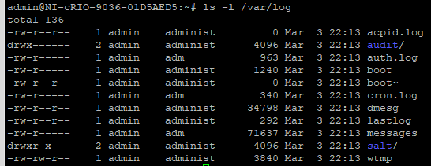

==================================
Logs on NI Linux Real-Time Systems
==================================

Introduction
============

This document is an introduction to some of the common logs on Linux Real-Time Systems.

Useful NI Linux Real-Time Logs
==============================

Logs in */var/log/*
-------------------

The Linux Operating System and many Linux utilities will write to ``/var/log/`` by default.
For example, the general ``messages`` log (or ``syslog`` depending on the system) is typically found here.

NI Linux Real-Time Systems are designed as embedded, headless systems that need to be able to recover should issues occur.
As such, the ``/var/log/`` directory is a symbolic link to ``/var/volatile/log/``.
The ``/var/volatile/log/`` directory is mapped to RAM instead of the persistent device storage.
This prevents the system’s device storage from filling with logs and causing other issues on devices with extremely limited storage but results in the logs not persisting through a reboot.
To make these logs persist through a reboot, see the Enabling Persistent Logs section of this document.

.. note:: The ``kern.log`` file is traditionally stored here, but on NI Linux Real-Time systems is instead located at ``/var/local/natinst/log/`` to ensure it persists between reboots.

.. csv-table:: NI Linux RT Logs
   :file: resources/nilrt-logs.csv
   :widths: 30, 30, 50
   :header-rows: 1

Logs in */var/local/natinst/log/*
---------------------------------

Most NI Software will log to the ``/var/local/natinst/log/`` directory.
The following logs will exist by default with LabVIEW Real-Time installed.
Note that some of these logs (such as ``kern.log``) are not created until something logs to them.
Some of these logs can be seen in NI MAX using the **View Error Log** context menu option.

.. csv-table:: NI Sofware Logs
   :file: resources/ni-logs.csv
   :widths: 30, 50, 50, 50
   :header-rows: 1

Logrotate
=========

To prevent logs from growing too large, NI Linux Real-Time includes the ``logrotate`` utility with some default configurations.
This utility is run as a ``cron`` job on NI Linux Real-Time systems.
For more information on the ``cron`` utility and ``logrotate`` utility, refer to the third-party documentation available online for these common Linux utilities.

The following describes the default configuration of ``logrotate`` on a NI Linux Real-Time System.

-  The ``logrotate`` utility is run every 5 minutes as ``cron`` job by default.
   This configuration is stored in ``/etc/cron.d/logrotate`` using the ``crontab`` file format.

-  The main ``logrotate`` configuration file (which defines defaults and settings for some logs) is stored at ``/etc/logrotate.conf``.
   Configuration files for individual logs can be found in the ``/etc/logrotate.d/`` directory.

   -  For information on the format of ``logrotate`` configuration files, refer to the publicly available manuals for the utility.

-  Per the default ``logrotate.conf`` file, logs are rotated daily with up to 4 copies archived.
   Older archives are deleted when a log is rotated if the maximum is hit.
   This configuration is overwritten by the configurations for individual files.

   -  For example, a configuration file might instead specify that the log is rotated hourly instead of the default setting.

When modifying these settings, keep in mind that many of the logs are stored in */var/log* and are therefore stored in volatile memory by default.
If the modified settings result in logs growing too large, it can result in the system running out of memory.
Even for logs stored in the device’s physical storage, it’s important to ensure that the logs don’t accidentally file up the device storage completely.
Use reasonable settings and consider rotating logs that grow quickly at specific file sizes whenever using non-default settings.

Logging to the System Log(s)
============================

When logging status or event information, it may be desirable to write to one of the logs outlined above.
The following list outlines some of the common logs and what methods are recommended for writing to them.

-  ``/var/local/natinst/log/errlog.txt``

   -  `Write to System Log VI <http://zone.ni.com/reference/en-XX/help/371361R-01/glang/write_to_system_log/>`_
      - On Linux Real-Time Systems, this will write to the ``errlog.txt`` file.

   -  `RT Debug String VI <http://zone.ni.com/reference/en-XX/help/370715P-01/lvrtvihelp/rt_debug_strings/>`_

      - On Linux Real-Time Systems, when the **Interface** is set to **Write to system log**, the input string will be written to the *errlog.txt* file.

-  ``/var/log/messages``

   -  `System Exec VI <https://zone.ni.com/reference/en-XX/help/371361R-01/glang/system_exec/>`_

      - Using the command ``logger <string>`` with the System Exec VI will write that string to the ``messages`` log.

Note that when writing to these logs that it’s important to be aware of how they behave.
For example, by default the ``errlog.txt`` file will persist across reboots but be rotated by ``logrotate`` very quickly due to file size while the ``messages`` log will not persist across reboots but will be rotated less often.

Persistent Logs
===============

Persistent logs setting controls whether contents of ``/var/log`` persist across device reboots or not.

NILRT >= 11.2
-------------

On NILRT releases >= 11.2, persistent logs are enabled by default. i.e., the contents of ``/var/log`` persist across device reboots.

To disable persistent logs (i.e., use volatile logs), run ``nirtcfg --set section=SystemSettings,token=PersistentLogs.enabled,value="False"`` on command-line and reboot the NI Linux Real-Time system.

NILRT <= 11.1
-------------
On older NILRT releases (NILRT <= 11.1), ``/var/log`` is a symlink to ``/var/volatile/log``.
The ``/var/volatile`` location is a RAM-based tmpfs filesystem whose contents are lost on each reboot.
This section explains how to make ``/var/log`` contents persistent.

.. note::
   These settings will only persist until a format or software upgrade is made.
   Once that happens, the Linux Real-Time settings may revert to their defaults for that version.

To modify these settings for the ``/var/log`` location:

.. note::
   To find the version of NILRT installed on the target, run ``cat /etc/os-release`` at the command-line.

NILRT >= 9.1
~~~~~~~~~~~~

1. At the command-line on the target, run ``nirtcfg --set section=SystemSettings,token=PersistentLogs.enabled,value="True"``.

2. **NILRT 9.1 only:** An additional step is required on NI Linux Real-Time 9.1.
   This step is not required on NI Linux Real-Time 9.2 and later.
   At the command-line on the target, run ``/etc/init.d/ni-configpersistentlogs``

3. Reboot the NI Linux Real-Time system.

To revert to using volatile logs, follow the same steps using ``value="False"`` in the ``nirtcfg`` command.

NILRT < 9.1
~~~~~~~~~~~~

1. Modify ``/etc/default/volatiles/00_core`` as follows via either a console, sFTP, or your preferred method for editing configuration files on Linux Real-Time systems.

   1. Find the entry in ``00_core`` for ``/var/log``.
      It should be similar to the following:

      ``l root root 0755 /var/log /var/volatile/log``

   2. Modify the entry by removing the line or commenting it out.

   3. Save or otherwise apply the changed file to the system.

2. Once volatiles on the system have been created the first time, the configuration is cached via the ``/etc/volatile.cache`` file.
   To force regeneration of these volatiles via the new settings, delete that file.

   ``rm /etc/volatile.cache``

3. The existing symbolic link must also be removed.
   This can be done by deleting ``/var/log``.

   ``rm /var/log``

   .. note::
     Do not add a trailing slash when removing the symlink.
     Doing so will not behave as intended.

4. Create a new ``/var/log`` directory so that the location is present upon reboot.

   ``mkdir /var/log``

5. Reboot the NI Linux Real-Time system.

----

Once the system has rebooted, you can check that the change has applied.
Instead of the symbolic link information, you should instead see the files located in ``/var/log``. 
Note that the image below may differ from your system depending on the software installed.
|image0|

